# FictionBook Editor Next

**FictionBook Editor Next** — современная сборка FictionBook Editor для Windows.  
Цель проекта — сохранить привычный редактор FB2, но обновить его окружение: сборку, установщик, shell-интеграцию Windows, проверку FB2, плагины импорта/экспорта и диагностику ошибок.

Проект основан на исходном FictionBook Editor:

- исходный репозиторий SeNS: <https://github.com/sensboston/fictionbookeditor>;
- reference-форк evpobr, использованный как источник отдельных исторических наработок: <https://github.com/evpobr/fictionbookeditor>.

## Что умеет программа

- Открывать, редактировать и сохранять книги FictionBook 2 (`.fb2`).
- Работать с русскими и украинскими ресурсами интерфейса.
- Проверять орфографию через Hunspell.
- Выполнять встроенные скрипты и пользовательские операции над структурой книги.
- Экспортировать книгу в HTML.
- Экспортировать книгу в DOCX и EPUB через подключаемые плагины.
- Импортировать EPUB через подключаемый плагин.
- Запускать проверку FB2 через FictionBook Validator (`FBV.exe`).
- Показывать свойства `.fb2` в Проводнике Windows: автор, название, язык, жанры, серия, версия документа, дата, ключевые слова и идентификатор.
- Показывать миниатюры обложек `.fb2` в Проводнике Windows.
- Устанавливать дополнительные batch-конвертеры для пакетного импорта/экспорта.

## Чем FictionBook Editor Next отличается от исходного FictionBook Editor

### Более современная установка

- Установщик обновлён и собирается автоматически.
- Установка стала чище: основные файлы программы, плагины, shell-интеграция и batch-конвертеры разделены по понятным секциям.
- Системная интеграция Windows устанавливается опционально и требует UAC только тогда, когда это действительно нужно.
- В «Программы и компоненты» Windows записываются версия, издатель, ссылка на проект и примерный размер установки.

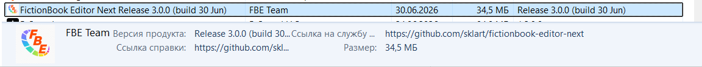

### Улучшенная интеграция с Проводником Windows

- `.fb2` получает нормальные свойства в правой панели сведений и в колонках Проводника.

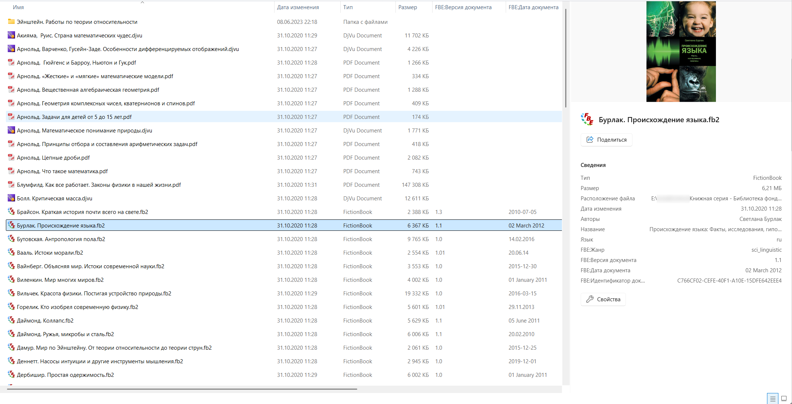

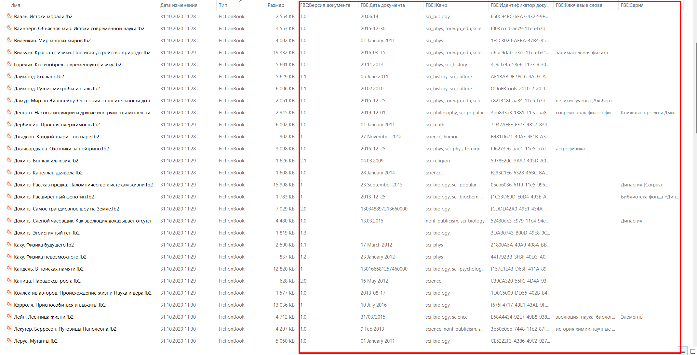
- Tooltip и панель сведений показывают метаданные книги.

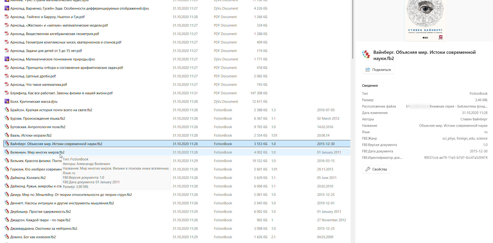
- Для книг со встроенной обложкой показываются миниатюры.

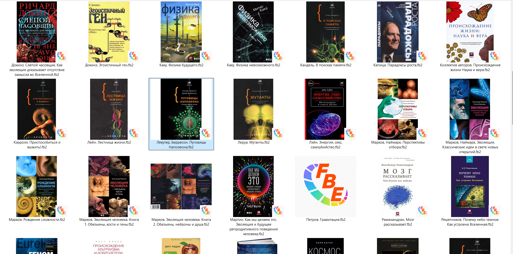
- Добавлена диагностика и набор smoke-тестов для проверки shell-регистрации, свойств и миниатюр.

### Проверка FB2 возвращена в исходники

- `FBV.exe` теперь собирается из исходников вместе с проектом.
- Команда проверки `.fb2` добавляется в контекстное меню.
- Название команды локализуется через MUI-ресурсы Windows, для команды проверки добавлена иконка.


### Новые плагины импорта и экспорта

- Добавлен плагин экспорта в DOCX.

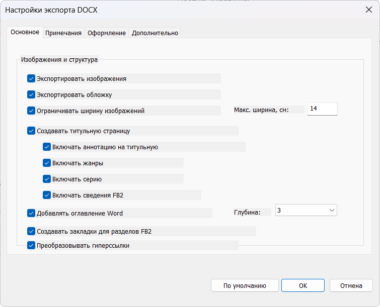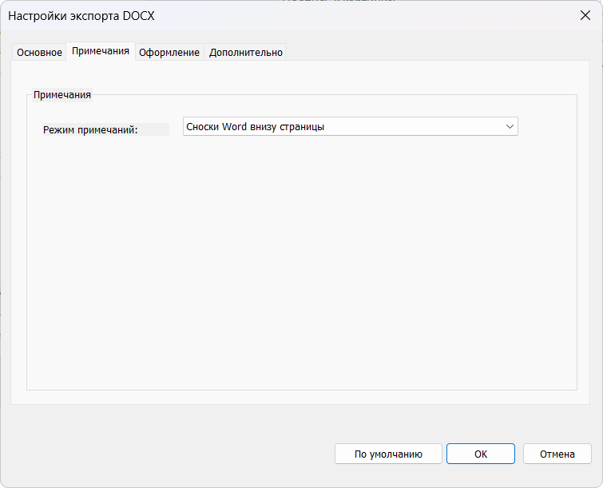
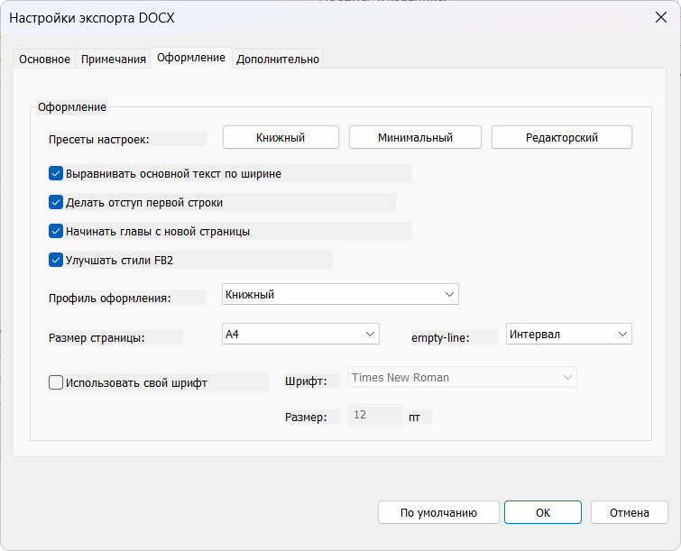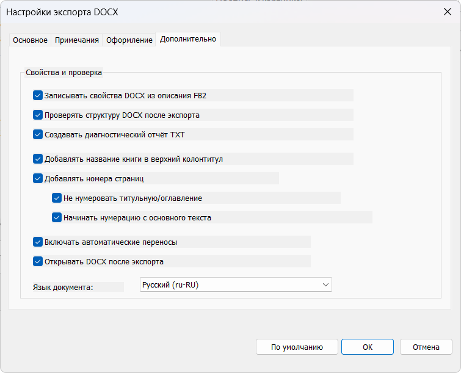
- Добавлен плагин экспорта в EPUB.

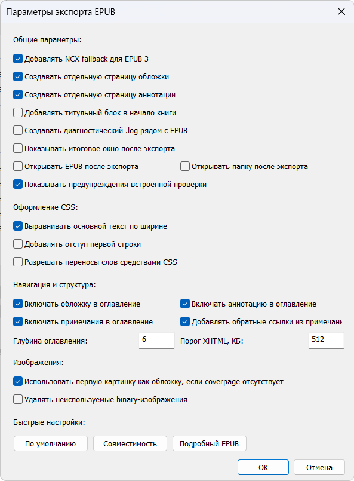
- Добавлен плагин импорта EPUB.

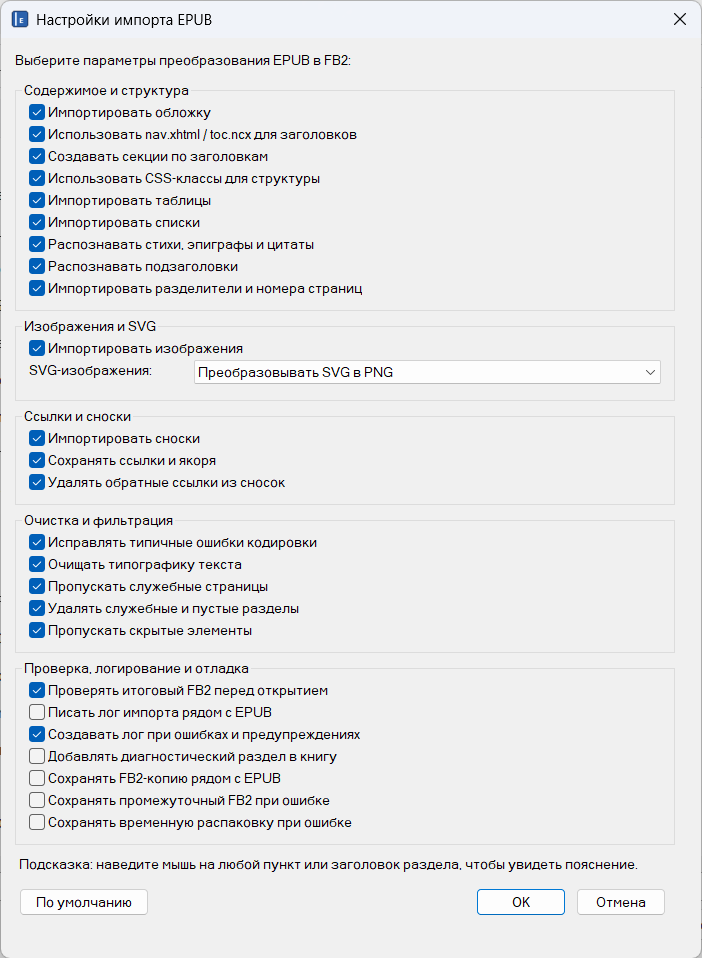
- Добавлены плагины экспорта в DOCX и EPUB, плагин импорта EPUB.

- Для ImportEPUB добавлена вспомогательная библиотека `ImportEPUBLunaSVG.dll`, которая помогает преобразовывать SVG-обложки EPUB в PNG/JPEG.

- Опционально можно установить batch-конвертеры для пакетного запуска импорта/экспорта из командной строки.

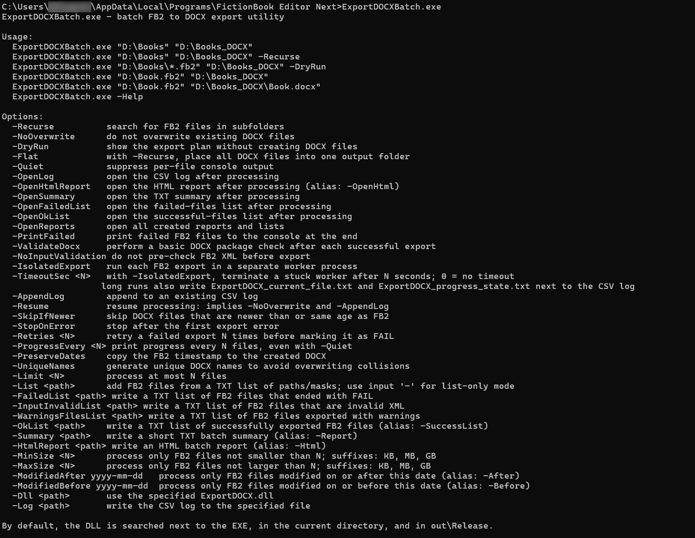

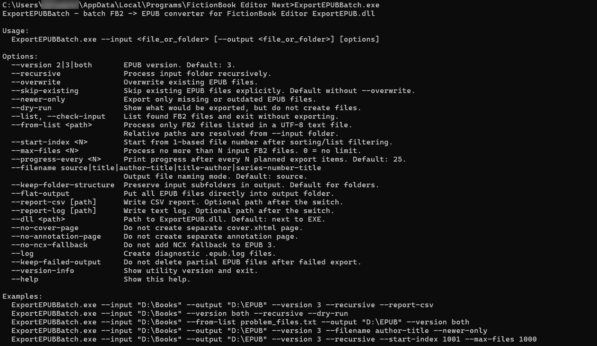

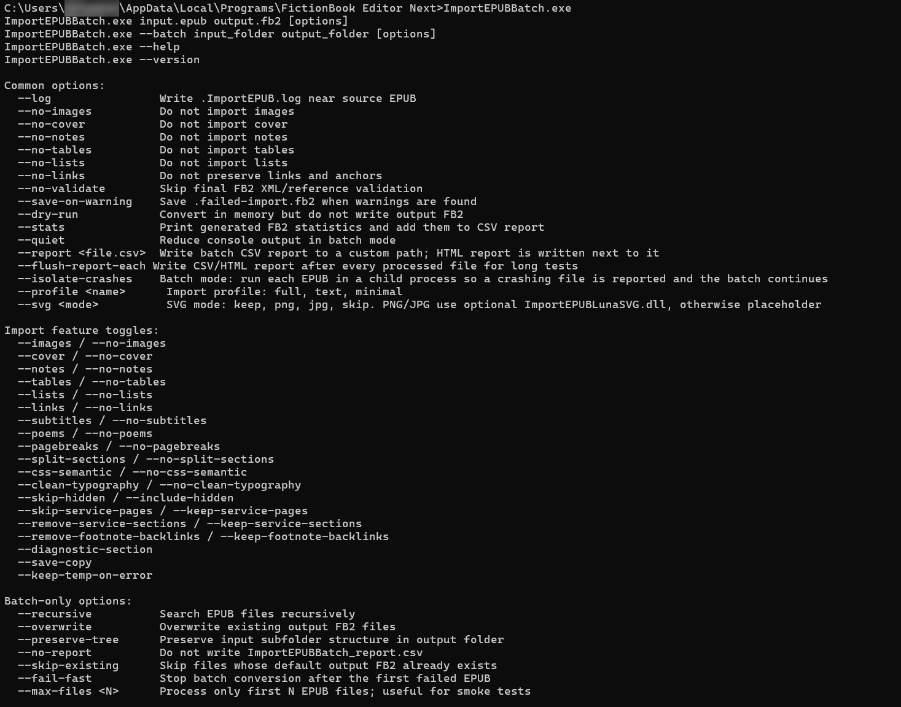

### Меньше риска потерять изменения

- Улучшена обработка файлов только для чтения: программа предупреждает пользователя до сохранения и предлагает сохранить копию через «Сохранить как…».

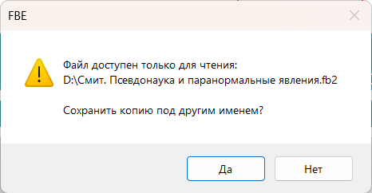
- Исправлены сценарии, где относительный путь к файлу из командной строки мог приводить к ошибке открытия.
- Добавлена локальная диагностика сбоев и архив debug-символов для релизов.

### Обновлены зависимости и сборка

- Проект адаптирован для современных версий Visual Studio.
- Обновлён орфографический движок Hunspell: это улучшает совместимость с современными словарями и снижает риск проблем при проверке нестандартных словоформ.
- Старый PCRE заменён на PCRE2: регулярные выражения теперь опираются на поддерживаемый современный движок.
- Исторический SciLexer заменён на актуальную связку Scintilla + Lexilla: source-view получает более современную основу для редактирования и подсветки XML.
- Автоматизированы проверки обновлений Scintilla, Lexilla, PCRE2 и Hunspell.
- Добавлены release-gate проверки: сборка, portable-пакет, установщик, ZIP с debug-символами, checksum-файл.

## Установка

В релизах GitHub публикуются:

- `FictionBookEditorNext-<version>-win32-setup.exe` — обычный установщик;
- `FictionBookEditorNext-<version>-win32-portable.zip` — portable-сборка;
- `FictionBookEditorNext-<version>-win32-symbols.zip` — debug-символы для диагностики падений;
- `SHA256SUMS.txt` — контрольные суммы артефактов.

Рекомендуемый вариант для большинства пользователей — установщик.

## Обновления

Проверка обновлений в окне «О программе» использует файл `update.xml` из этого репозитория.  
Релиз считается доверенным только если ссылка ведёт на GitHub Releases проекта FictionBook Editor Next и имя установщика соответствует ожидаемому формату.

## Сборка из исходников

Требуется Windows и Visual Studio с C++ workload.

```powershell
git submodule update --init --recursive
.\tools\build\build.ps1 -Configuration Release -Platform Win32 -SkipUpx
.\tools\build\verify-release.ps1 -Configuration Release
.\tools\build\create-release.ps1 -Configuration Release -Platform Win32 -SkipBuild -SkipUpx
```

Готовые файлы будут в `out\artifacts`.

Подробности:

- [docs/building.md](docs/building.md)
- [docs/versioning.md](docs/versioning.md)
- [docs/release-checklist.md](docs/release-checklist.md)
- [docs/manual-test-plan.md](docs/manual-test-plan.md)

## Документация для разработчиков

- [docs/technical-changes-from-sensboston.md](docs/technical-changes-from-sensboston.md) — техническое описание отличий от исходного проекта.
- [docs/test-contours.md](docs/test-contours.md) — карта автоматических и ручных тестовых контуров.
- [docs/shell-extension-modernization.md](docs/shell-extension-modernization.md) — modern shell-интеграция.
- [docs/upstream-evpobr-analysis.md](docs/upstream-evpobr-analysis.md) — заметки по reference-форку evpobr.

## Лицензия

Проект сохраняет лицензионную модель исходного FictionBook Editor: GNU General Public License v3.  
Тексты лицензии находятся в runtime-файлах проекта.

## Благодарности

Спасибо авторам исходного FictionBook Editor, SeNS, LitRes, Mike Matsnev, авторам скриптов, переводчикам, тестировщикам и всем, кто поддерживал редактор живым. FictionBook Editor Next — это продолжение этой линии, а не попытка стереть историю проекта.
